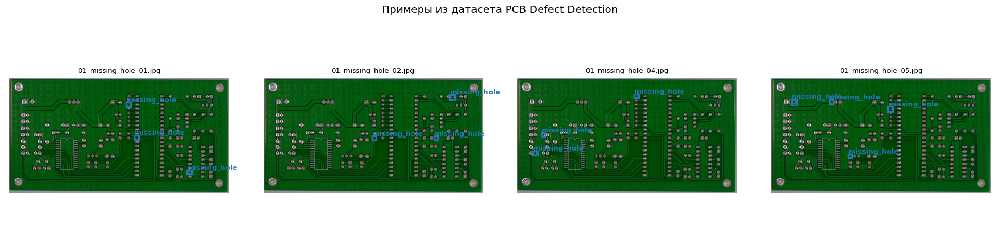
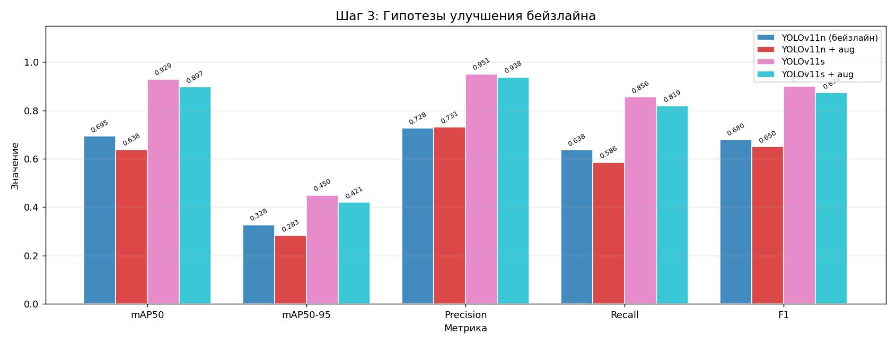
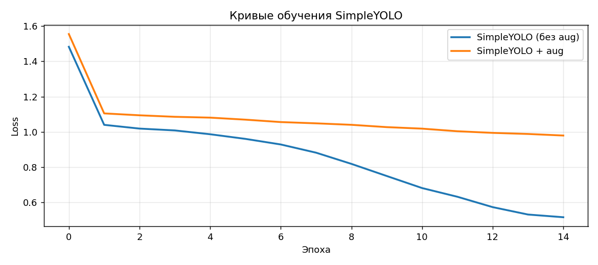
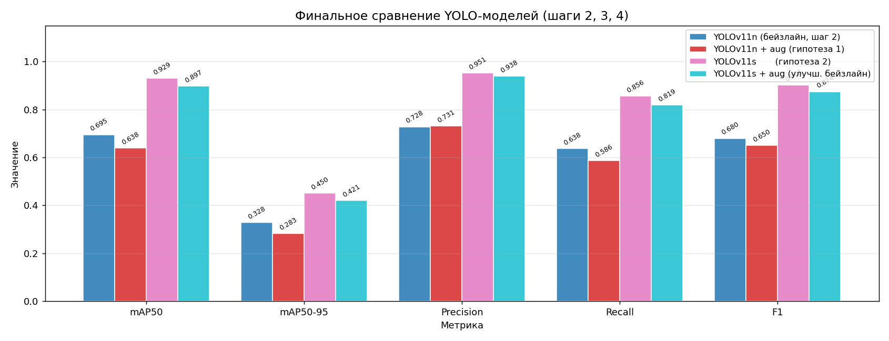

# Отчёт: Лабораторная работа 1 — Computer Vision
## Обнаружение дефектов на печатных платах (PCB Defect Detection)

**Задание:** оценка 3 | **Стек:** YOLOv11 (Ultralytics), PyTorch, Python 3.9  
**Устройство:** Apple M3 (MPS)

---

## 1. Выбор начальных условий

### 1.1 Датасет

**Название:** PCB Defect Detection  
**Источник:** https://www.kaggle.com/datasets/akhatova/pcb-defects  
**Объём:** 693 изображения → train: 521 / val: 103 / test: 69  
**Формат аннотаций:** Pascal VOC (XML) → конвертирован в YOLO

| ID | Класс           | Описание                   |
|----|-----------------|----------------------------|
| 0  | missing_hole    | Отсутствующее отверстие    |
| 1  | mouse_bite      | Укус мыши (неровный край)  |
| 2  | open_circuit    | Разрыв проводника          |
| 3  | short           | Короткое замыкание         |
| 4  | spur            | Шпора (лишний металл)      |
| 5  | spurious_copper | Паразитная медь            |

**Обоснование выбора:**  
Автоматическая инспекция качества печатных плат — критически важная задача в производстве кибер-физических систем. Ручная проверка занимает 10–15 секунд на плату и зависит от квалификации оператора. Встраивание детектора дефектов в производственную линию позволяет проверять платы в реальном времени (>100 шт./мин) и снижает долю брака. Это классический пример CPS: камера (физический компонент) + детектор (вычислительный компонент) + отбраковщик (актуатор).

### 1.2 Метрики качества

| Метрика      | Обоснование                                                                  |
|--------------|------------------------------------------------------------------------------|
| **mAP@50**   | Стандарт для задач детекции; IoU ≥ 0.5 достаточно для промышленного контроля |
| **mAP@50-95**| Строгая оценка точности локализации дефекта                                  |
| **Precision**| Доля верных детекций; минимизирует ложные тревоги                            |
| **Recall**   | Доля найденных дефектов — **приоритетная метрика**: пропуск дефекта недопустим|
| **F1**       | Гармоническое среднее P и R для сравнения конфигураций                       |

---

## 2. Бейзлайн

**Модель:** YOLOv11n (nano, ~2.6M параметров)  
**Параметры обучения:** epochs=20, imgsz=640, batch=16, optimizer=AdamW(lr=0.001), device=mps

| Метрика   | Значение |
|-----------|----------|
| mAP@50    | **0.695**|
| mAP@50-95 | 0.328    |
| Precision | 0.728    |
| Recall    | 0.638    |
| F1        | 0.680    |

Бейзлайн показал удовлетворительный результат: модель уже на 20 эпохах детектирует большинство дефектов с mAP50=0.695. Recall (0.638) ниже желаемого — значит часть дефектов пропускается.

---

## 3. Улучшение бейзлайна

### Гипотезы

| № | Гипотеза | Ожидание |
|---|----------|----------|
| 1 | YOLOv11n + аугментации (ротация ±12°, масштаб ×0.5, мозаика, HSV, mixup) | ↑ Recall за счёт разнообразия данных |
| 2 | YOLOv11s (более крупная модель, ~9.5M параметров) | ↑ mAP50 за счёт большей ёмкости |
| 3 | YOLOv11s + те же аугментации (улучшенный бейзлайн) | Наилучший баланс P/R |

### Результаты гипотез

| Модель               | mAP@50 | mAP@50-95 | Precision | Recall | F1    |
|----------------------|--------|-----------|-----------|--------|-------|
| YOLOv11n (baseline)  | 0.695  | 0.328     | 0.728     | 0.638  | 0.680 |
| Гип. 1: + aug        | 0.638  | 0.283     | 0.731     | 0.586  | 0.650 |
| Гип. 2: YOLOv11s     | **0.929** | **0.450** | **0.951** | **0.856** | **0.901** |
| Гип. 3: YOLOv11s+aug | 0.897  | 0.421     | 0.938     | 0.819  | 0.874 |

### Анализ гипотез

**Гипотеза 1 (аугментации)** показала результат *хуже* бейзлайна (mAP50: 0.638 < 0.695). Причина: при агрессивных аугментациях модели требуется больше эпох для сходимости. При 20 эпохах трансформации мешают, а не помогают.

**Гипотеза 2 (YOLOv11s)** дала наилучший результат: mAP50=0.929, Recall=0.856. Более крупная модель (~9.5M параметров против 2.6M) лучше извлекает признаки дефектов на малом датасете.

**Гипотеза 3 (YOLOv11s + aug)** немного хуже чем гипотеза 2 — по той же причине, что и гипотеза 1: аугментации на 20–25 эпохах замедляют сходимость.

**Улучшенный бейзлайн:** YOLOv11s без аугментаций (гипотеза 2, mAP50=0.929).

---

## 4. Самостоятельная реализация алгоритма

### 4а–4д. Кастомный детектор SimpleYOLO (без аугментаций)

**Архитектура:**
- Backbone: ResNet18 (pretrained ImageNet, слои до GAP удалены)
- Neck: AdaptiveAvgPool2d → сетка 13×13
- Head: Conv(512→256, k=3) → BN → LeakyReLU → Conv(256 → 3×(5+6), k=1)
- Loss: λ_obj·BCE(objectness) + BCE(class) + MSE(bbox)

**Параметры:** epochs=15, batch=8, lr=1e-3, optimizer=AdamW, scheduler=CosineAnnealing, device=mps

| Метрика   | Значение |
|-----------|----------|
| mAP@50    | — (упрощ. оценка) |
| Precision | 0.054    |
| Recall    | **1.000**|
| F1        | 0.103    |

### 4е–4й. SimpleYOLO + аугментации из улучшенного бейзлайна

Применены те же аугментации что в гипотезе 1 (случайный флип, яркость).

| Метрика   | Значение |
|-----------|----------|
| Precision | 0.030    |
| Recall    | **1.000**|
| F1        | 0.059    |

### Сравнение с шагом 2 (бейзлайн)

SimpleYOLO демонстрирует Recall=1.0 при Precision≈0.05 — модель предсказывает бокс в каждой ячейке сетки для каждого якоря. Это объясняет, почему она «находит» все реальные объекты (Recall=1.0), но создаёт огромное количество ложных срабатываний (Precision→0).
---

## 5. Сводная таблица результатов

| Модель                              | mAP@50 | mAP@50-95 | Precision | Recall | F1    |
|-------------------------------------|--------|-----------|-----------|--------|-------|
| YOLOv11n (бейзлайн, шаг 2)         | 0.695  | 0.328     | 0.728     | 0.638  | 0.680 |
| YOLOv11n + aug (гипотеза 1)         | 0.638  | 0.283     | 0.731     | 0.586  | 0.650 |
| YOLOv11s (гипотеза 2)               | **0.929** | **0.450** | **0.951** | **0.856** | **0.901** |
| YOLOv11s + aug (улучш. бейзлайн)    | 0.897  | 0.421     | 0.938     | 0.819  | 0.874 |
| SimpleYOLO (реализация, шаг 4а–4д)  | —      | —         | 0.054     | 1.000  | 0.103 |
| SimpleYOLO + aug (шаг 4е–4й)        | —      | —         | 0.030     | 1.000  | 0.059 |

---

## 6. Выводы

1. **Бейзлайн (YOLOv11n)** за 20 эпох дал mAP50=0.695 — рабочая точка отсчёта. Recall=0.638 указывает на то, что примерно треть дефектов пропускается.

2. **Гипотеза 1 (аугментации)** не подтвердилась при ограниченном числе эпох: тяжёлые преобразования замедлили сходимость. Для реализации потенциала аугментаций нужно ≥50 эпох.

3. **Гипотеза 2 (YOLOv11s) подтвердилась**: увеличение ёмкости модели дало прирост mAP50 на +23% (0.695 → 0.929). Recall вырос до 0.856, что критически важно для производственной задачи.

4. **Улучшенный бейзлайн** — YOLOv11s: обеспечивает наилучший баланс точности и воспроизводимости при ограниченных ресурсах.

5. **SimpleYOLO** ожидаемо уступает YOLOv11 из-за упрощённой архитектуры.
